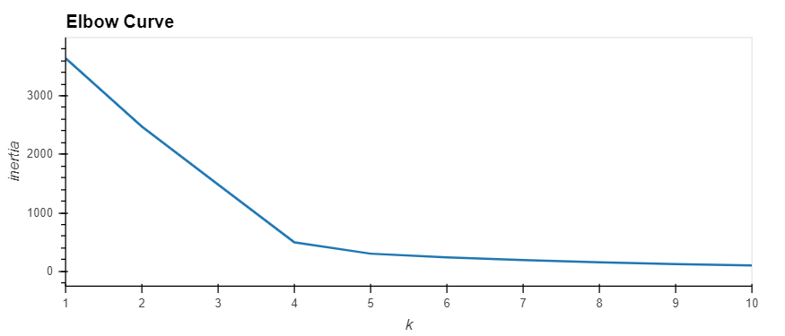
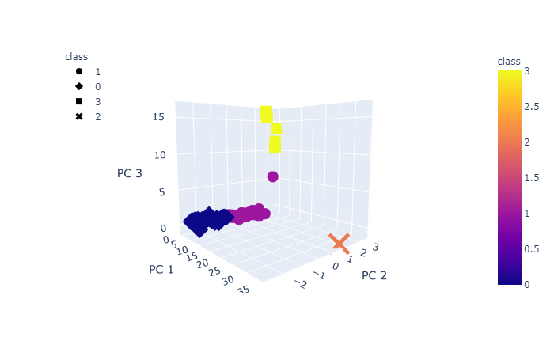
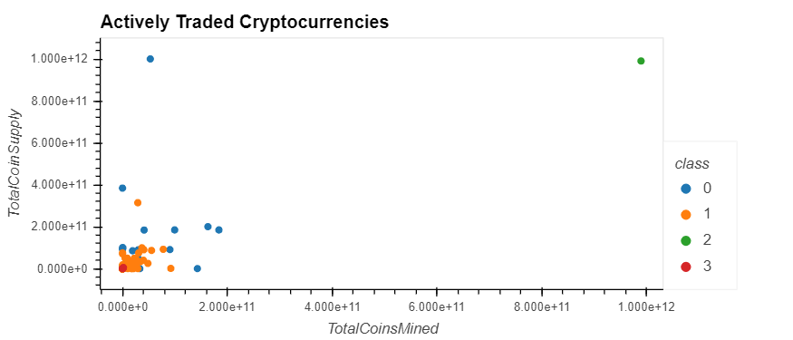
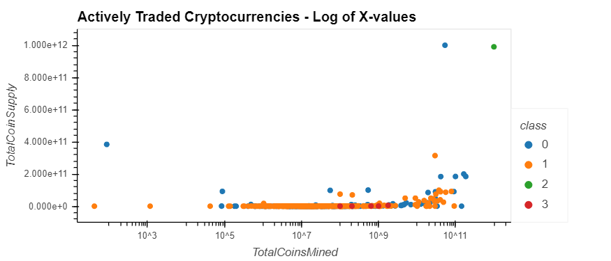
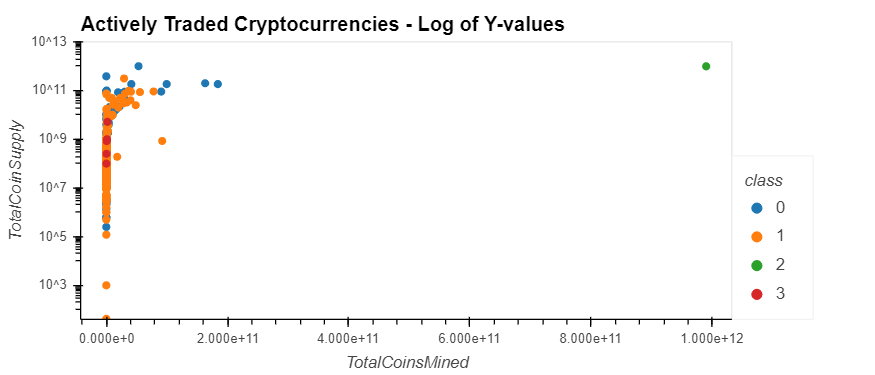
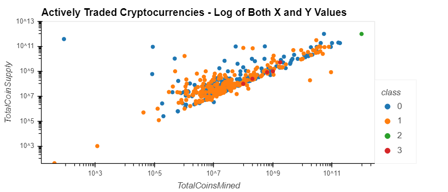
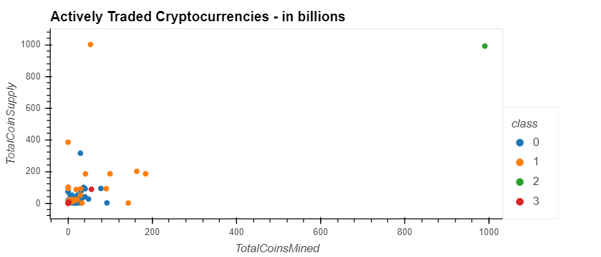
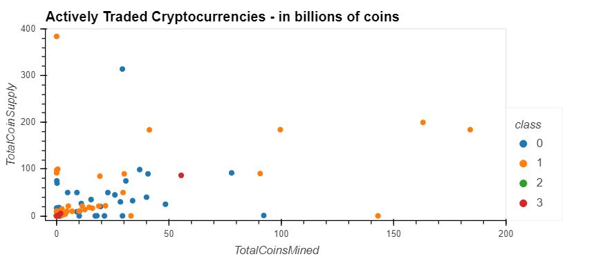

# Cryptocurrencies

Completed all instructions for the Module 18 challenge.  ***Sunday night uploaded a second, scaled version of Challenge ("Challenge - Scaled.ipynb"), along with 2 versions of the scaled scatter plot - the first has all actively traded cryptocurrences.  The second excludes 2 outliers, TurtleCoin and BitTorrent that appear to be outliers.***

1. Loaded the preprocessed cryptocurrencies dataset (crypto_data.csv) and indexed to the first column, which is the ticker.
2. Loaded the data in a Pandas DataFrame named “crypto_df”.
3. Removed all cryptocurrencies that aren’t trading.
4. Checked for cryptocurrencies that don’t have an algorithm defined.  All did. No removals.
5. Removed the "IsTrading" column.
6. Removed all cryptocurrencies with at least one null value.
7. Removed all cryptocurrencies without coins mined and one that had a negative # (Fiii) .
8. Stored the names of all cryptocurrencies in a DataFramed named coins_name, and used the crypto_df.index as the index for this new DataFrame.
***8(b)  Scaled cryptocurrency units in "Challenge - Scaled.ipynb" by dividing by 1 billions***
9. Removed the CoinName column from the crypto_df DataFrame.
10. Created dummies variables for all of the text features, and store the resulting data in a DataFrame named X.
11. Used the StandardScaler from sklearn to standardize all of the data from the X DataFrame. 
12. Reduced the dimensions of the X DataFrame down to three principal components.
13. Created a DataFrame named “pcs_df” that includes the following columns: PC 1, PC 2, and PC 3. Used the crypto_df.index as the index for this new DataFrame.
14. Used the KMeans algorithm from sklearn to cluster the cryptocurrencies using the PCA data.
    1. Created an elbow curve to find the best value for *K* (which was 4), and used the pcs_df DataFrame.
    
    
    2. Ran the K-means algorithm to predict the *K* clusters for the cryptocurrencies’ data. Used the pcs_df to run the K-means algorithm.
    3. Created a new DataFrame named “clustered_df,” that includes the following columns: Algorithm, ProofType, TotalCoinsMined, TotalCoinSupply, PC 1, PC 2, PC 3, CoinName, and Class. I maintained the index of the crypto_df DataFrame.
15. Visualized results.
    1. Created a 3D scatter plot using Plotly Express to plot the clusters using the clustered_df DataFrame. Included the following parameters on the plot: `hover_name="CoinName" and hover_data=["Algorithm"] `to show this additional info on each data point.
    
    
    2. Used `hvplot.table` to create a data table with all the current tradable cryptocurrencies. The table has the following columns: CoinName, Algorithm, ProofType, TotalCoinSupply, TotalCoinsMined, and Class.
    3. Created a scatter plot using `hvplot.scatter` to present the clustered data about cryptocurrencies having x="TotalCoinsMined" and y="TotalCoinSupply" to contrast the number of available coins versus the total number of mined coins. Used the hover_cols=["CoinName"] parameter to include the cryptocurrency name on each data point.  Also, produced several more scatter plots, the first using log values on the x-axis, the second using log values on the y-axis, and a third with log values on both axes.  For the Y-axis logs, I set the minimum value  at 40, so there would be no errors from a log of zero.
    
    
    
    
***16.  Here are the 2 scatter plots from the "Challenge - Scaled" notebook.  1 billion - 1 unit.  The second plot removes 2 outliers, TurtleCoin and BitTorrent***
    
    
